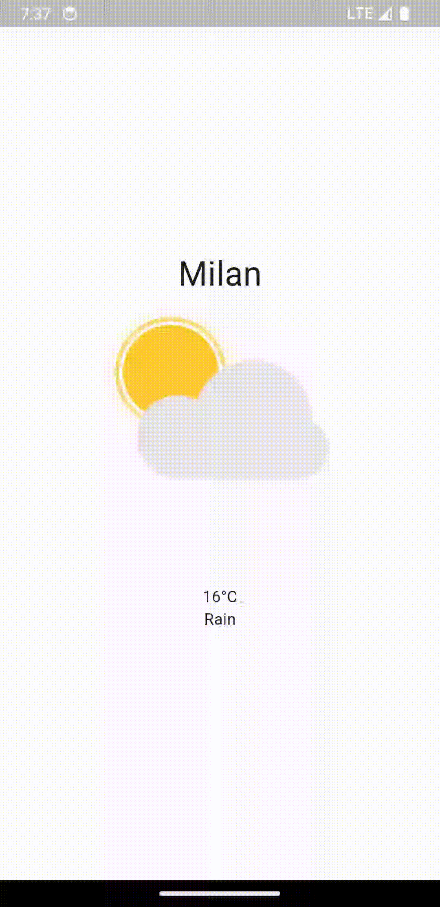
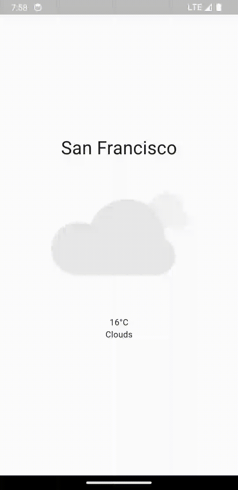

# Minimal Weather App

This is a minimalist weather app developed in Flutter that consumes the OpenWeatherMap API and LottieFiles animations.

## Features

- Get current location.
- Displays current weather forecast.
- Uses Lottie animations for a pleasant visual experience.

## Images

<p align="center">
     

<p align="center">

</p>


## How to Use

1. Clone this repository to your local environment.
2. Make sure you have Flutter installed on your machine.
3. Open the project in your preferred code editor.
4. Run the app on an emulator or physical device.

## Configuration

Before running the app, you'll need an OpenWeatherMap API key. Follow these steps to set up the API key:

1. Go to [OpenWeatherMap](https://openweathermap.org/) and log in or create an account.
2. In your account, navigate to the "API keys" section to generate a new API key.
3. Copy your generated API key.
4. In the project directory, create a file named `secrets.dart` inside the `lib` folder.
5. Inside the `secrets.dart` file, add the following code:

```dart
const String openWeatherMapApiKey = 'YOUR_API_KEY_HERE';
```

Replace `'YOUR_API_KEY_HERE'` with the API key you copied earlier.

## Running the App

After setting up the API key, you can run the app:

1. Open a terminal in the project root.
2. Run the command `flutter pub get` to install dependencies.
3. Run the command `flutter run` to start the app on the emulator or connected device.